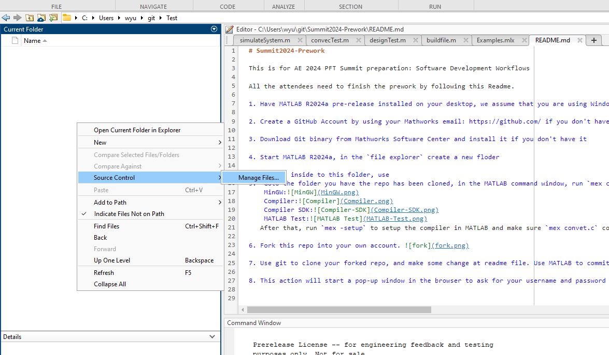
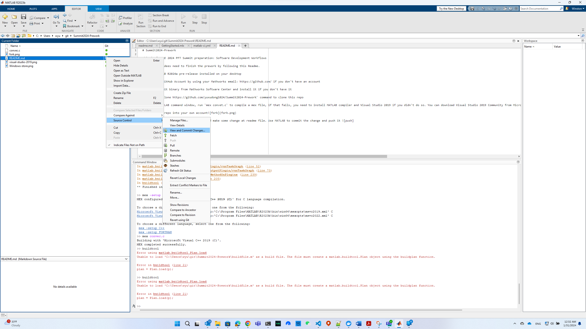

# Summit2024-Prework

This is for AE 2024 PFT Summit preparation: Software Development Workflows

All the attendees need to finish the prework by following this Readme.

1. This guide works for Windows only. You need to have MATLAB R2024a pre-release installed on your desktop and not use MATLAB New Desktop with Java Script.

2. Create a GitHub Account by using your Mathworks email: `https://github.com` if you don't have an account, make sure that in the git email setting, you don't block command line push:
    

3. Download Git binary from Mathworks Software Center and install it if you don't have it

4. Fork this repo into your own account. 

5. Start MATLAB R2024a, in the `file explorer` tab of MATLAB create a new folder
   
 
   Go inside this folder, and use right click of the mouse to clone ypur forked repo
    
   

   MATLAB may ask for your git account email and password, type it, and clone the repo.

6. Goto the folder you have the repo has been cloned, in the MATLAB command window, run `mex convec.c` to compile a mex file. If it works, then you can go to next step, if that fails, you need to install MATLAB compiler and MinGW compiler if you didn't do so. You can do so by running `installMinGW` from the command line or through MATLAB Add-Ons. 

    MinGW: 
    Compiler:

    After that, run `mex -setup` to setup the compiler in MATLAB and make sure `mex convec.c` command works.

7. Install compiler SDK and MATLAB Test if you didn't install it

    Compiler SDK:
    MATLAB Test:

8. Make some changes to this readme file in your cloned repo. Use MATLAB to commit the change and push the change. 

9. This action will start a pop-up window in the browser to ask for your username and password for GitHub, after you type it, MATLAB will remember it and you don't need to type it anymore.

